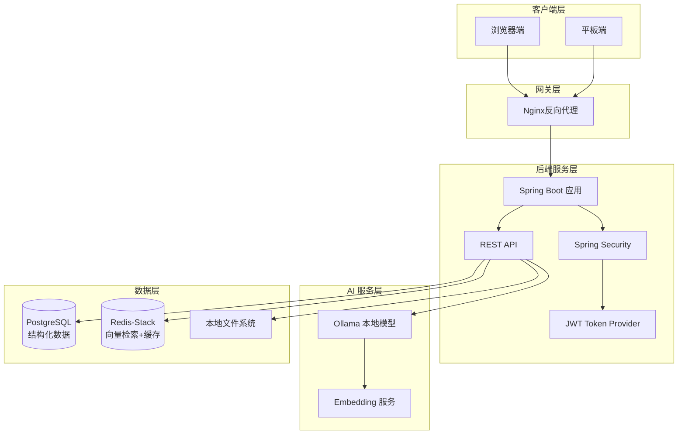
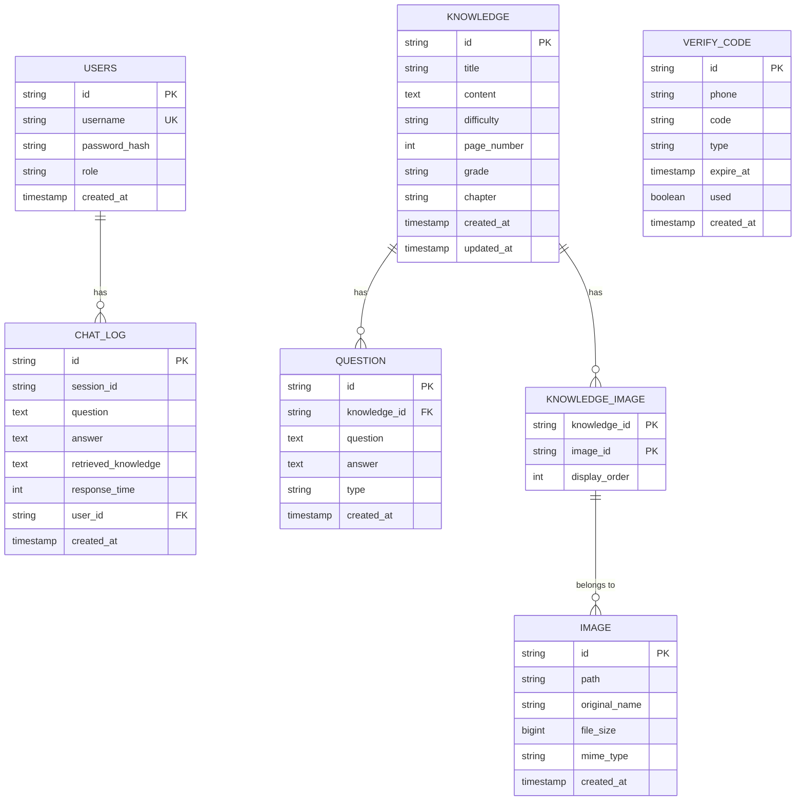
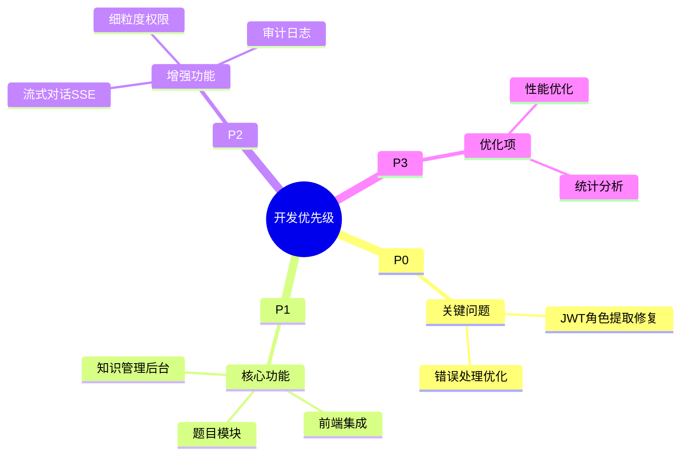

# GeoEdu 开发指南

> 本文档为 GeoEdu 地理智能问答系统提供完整的开发指导，涵盖项目架构、API 接口、数据规范、配置管理及测试方法。

---

## 1. 项目概述

### 1.1 技术栈

| 层级 | 技术选型 | 版本 | 说明 |
|------|---------|------|------|
| 后端框架 | Spring Boot | 3.2.3 | 企业级应用框架 |
| 安全框架 | Spring Security | 6.x | 认证授权 |
| AI 对接 | Spring AI | 1.0.0-M6 | 统一 AI 抽象层 |
| 本地模型 | Ollama | - | LLM 推理引擎 |
| 关系数据库 | PostgreSQL | 16 | 结构化数据存储 |
| 缓存/向量 | Redis-Stack | 7.4.0 | 向量检索 + 缓存 |
| ORM 框架 | MyBatis | 3.0.3 | 数据访问层 |
| 认证 | JWT | 0.12.3 | Token 管理 |
| 构建工具 | Maven | 3.9+ | 项目构建 |

### 1.2 架构图



### 1.3 核心功能

| 功能模块 | 说明 |
|---------|------|
| RAG 智能问答 | 基于向量检索的增强生成问答 |
| 知识库管理 | 知识点 CRUD，支持按年级/章节/难度筛选 |
| 用户认证 | JWT-based 认证，支持学生/教师/管理员角色 |
| 图片管理 | 上传、绑定、展示知识相关图片 |
| 题目管理 | 关联题目的创建与管理 |

### 1.4 项目结构

```
geoedu/
├── src/main/java/com/geoedu/
│   ├── config/                 # 配置类
│   │   ├── AppConfig.java
│   │   ├── GlobalExceptionHandler.java
│   │   ├── JwtAuthenticationFilter.java
│   │   ├── JwtTokenProvider.java
│   │   ├── OllamaConfig.java
│   │   ├── RedisConfig.java
│   │   └── SecurityConfig.java
│   ├── controller/             # 控制层
│   │   ├── AdminController.java
│   │   ├── AuthController.java
│   │   ├── ChatController.java
│   │   ├── ImageController.java
│   │   ├── KnowledgeController.java
│   │   └── QuestionController.java
│   ├── mapper/                 # MyBatis Mapper
│   ├── model/
│   │   ├── dto/               # 数据传输对象
│   │   └── entity/            # 实体类
│   ├── service/               # 业务层
│   ├── util/                  # 工具类
│   └── GeoEduApplication.java
├── src/main/resources/
│   ├── mapper/                # MyBatis XML 映射文件
│   ├── application.yml        # 应用配置
│   ├── schema.sql             # 数据库表结构
│   └── init.sql               # 初始化数据
├── src/test/java/             # 测试代码
├── docs/                      # 项目文档
├── docker-compose.yml         # Docker 编排
└── pom.xml                    # Maven 配置
```

---

## 2. API 文档

### 2.1 基本规范

| 项目 | 规范 |
|------|------|
| 协议 | HTTP/HTTPS |
| 编码 | UTF-8 |
| Content-Type | application/json |
| 认证方式 | JWT Bearer Token |
| API 版本 | URL 路径版本控制 `/api/v1/` |
| 基础 URL | `http://localhost:8080/api/v1` |

### 2.2 响应格式

**成功响应**：

```json
{
  "code": 0,
  "message": "success",
  "data": {},
  "timestamp": 1711545600
}
```

**错误响应**：

```json
{
  "code": 40001,
  "message": "用户名已存在",
  "errors": [
    {
      "field": "username",
      "message": "重复"
    }
  ],
  "timestamp": 1711545600
}
```

### 2.3 Endpoints 清单

| 方法 | 路径 | 认证 | 角色 | 说明 |
|------|------|------|------|------|
| POST | /auth/login | 否 | - | 用户登录 |
| POST | /auth/register | 否 | - | 用户注册 |
| POST | /chat | 是 | ALL | 智能问答 |
| GET | /knowledge | 是 | ALL | 知识点列表 |
| GET | /knowledge/{id} | 是 | ALL | 获取知识点详情 |
| POST | /knowledge | 是 | TEACHER, ADMIN | 创建知识点 |
| PUT | /knowledge/{id} | 是 | TEACHER, ADMIN | 更新知识点 |
| DELETE | /knowledge/{id} | 是 | ADMIN | 删除知识点 |
| GET | /knowledge/search | 是 | ALL | 搜索知识点 |
| POST | /question | 是 | ALL | 创建题目 |
| GET | /question/{id} | 是 | ALL | 获取题目详情 |
| GET | /question/knowledge/{knowledgeId} | 是 | ALL | 获取知识点关联题目 |
| PUT | /question/{id} | 是 | ALL | 更新题目 |
| DELETE | /question/{id} | 是 | ALL | 删除题目 |
| POST | /image/upload | 是 | TEACHER, ADMIN | 上传图片 |
| GET | /admin/health | 是 | ADMIN | 健康检查 |
| POST | /admin/rebuild-vectors | 是 | ADMIN | 重建向量索引 |
| POST | /admin/backup | 是 | ADMIN | 数据备份 |

### 2.4 认证接口

#### 2.4.1 用户登录

```http
POST /api/v1/auth/login
```

| 参数 | 类型 | 必填 | 说明 |
|------|------|------|------|
| username | String | 是 | 用户名 |
| password | String | 是 | 密码 |

**请求示例**：

```json
{
  "username": "teacher01",
  "password": "password123"
}
```

**响应示例**：

```json
{
  "code": 0,
  "message": "success",
  "data": {
    "token": "eyJhbGciOiJIUzI1NiIs...",
    "expiresIn": 604800000,
    "user": {
      "id": "U001",
      "username": "teacher01",
      "role": "teacher"
    }
  },
  "timestamp": 1711545600
}
```

#### 2.4.2 用户注册

```http
POST /api/v1/auth/register
```

| 参数 | 类型 | 必填 | 说明 |
|------|------|------|------|
| username | String | 是 | 用户名，4-20字符 |
| password | String | 是 | 密码，6-20字符 |
| role | String | 否 | 角色，默认 student |

**请求示例**：

```json
{
  "username": "student01",
  "password": "password123",
  "role": "student"
}
```

### 2.5 问答接口

#### 2.5.1 智能问答

```http
POST /api/v1/chat
Authorization: Bearer <token>
```

| 参数 | 类型 | 必填 | 说明 |
|------|------|------|------|
| question | String | 是 | 用户问题，最大200字 |
| topK | Integer | 否 | 检索结果数量，默认3 |

**请求示例**：

```json
{
  "question": "地转偏向力是如何产生的？",
  "topK": 3
}
```

**响应示例**：

```json
{
  "code": 0,
  "message": "success",
  "data": {
    "answer": "地转偏向力是...",
    "images": [
      {
        "id": "IMG001",
        "path": "/images/G1-1-01_1.jpg"
      }
    ],
    "relatedKnowledge": [
      {
        "id": "G1-1-01",
        "title": "地球自转的地理意义"
      }
    ],
    "relatedQuestions": [
      {
        "id": "Q1",
        "question": "地转偏向力的方向如何判断？",
        "answer": "北半球向右偏..."
      }
    ]
  },
  "timestamp": 1711545600
}
```

### 2.6 知识库接口

#### 2.6.1 知识点列表

```http
GET /api/v1/knowledge
Authorization: Bearer <token>
```

| 参数 | 类型 | 必填 | 说明 |
|------|------|------|------|
| page | Integer | 否 | 页码，默认0 |
| size | Integer | 否 | 每页数量，默认10 |
| grade | String | 否 | 按年级筛选，如 G1 |
| chapter | String | 否 | 按章节筛选，如 1 |
| difficulty | String | 否 | 按难度筛选 easy/medium/hard |

**响应示例**：

```json
{
  "code": 0,
  "message": "success",
  "data": {
    "items": [
      {
        "id": "G1-1-01",
        "title": "地球自转的地理意义",
        "content": "地球自转导致昼夜交替...",
        "difficulty": "medium",
        "pageNumber": 10,
        "grade": "G1",
        "chapter": "1",
        "imageUrls": ["/images/G1-1-01_1.jpg"]
      }
    ],
    "total": 100,
    "page": 0,
    "size": 10,
    "pages": 10
  },
  "timestamp": 1711545600
}
```

#### 2.6.2 获取知识点详情

```http
GET /api/v1/knowledge/{id}
Authorization: Bearer <token>
```

#### 2.6.3 创建知识点

```http
POST /api/v1/knowledge
Authorization: Bearer <token>
```

| 参数 | 类型 | 必填 | 说明 |
|------|------|------|------|
| id | String | 是 | 知识点ID |
| title | String | 是 | 标题，最大200字 |
| content | String | 是 | 正文内容 |
| difficulty | String | 否 | 难度：easy/medium/hard |
| pageNumber | Integer | 否 | 教材页码 |
| grade | String | 否 | 年级，如 G1 |
| chapter | String | 否 | 章节号 |

**请求示例**：

```json
{
  "id": "G1-1-01",
  "title": "地球自转的地理意义",
  "content": "地球自转导致昼夜交替...",
  "difficulty": "medium",
  "pageNumber": 10,
  "grade": "G1",
  "chapter": "1"
}
```

#### 2.6.4 更新知识点

```http
PUT /api/v1/knowledge/{id}
Authorization: Bearer <token>
```

#### 2.6.5 删除知识点

```http
DELETE /api/v1/knowledge/{id}
Authorization: Bearer <token>
```

#### 2.6.6 搜索知识点

```http
GET /api/v1/knowledge/search?keyword=地球自转
Authorization: Bearer <token>
```

| 参数 | 类型 | 必填 | 说明 |
|------|------|------|------|
| keyword | String | 是 | 搜索关键词 |
| page | Integer | 否 | 页码，默认0 |
| size | Integer | 否 | 每页数量，默认10 |

### 2.7 题目接口

#### 2.7.1 创建题目

```http
POST /api/v1/question
Authorization: Bearer <token>
```

| 参数 | 类型 | 必填 | 说明 |
|------|------|------|------|
| knowledgeId | String | 是 | 关联知识点ID |
| question | String | 是 | 题干 |
| answer | String | 是 | 答案 |
| type | String | 否 | 题目类型，默认 default |

#### 2.7.2 获取题目

```http
GET /api/v1/question/{id}
Authorization: Bearer <token>
```

#### 2.7.3 获取知识点关联题目

```http
GET /api/v1/question/knowledge/{knowledgeId}
Authorization: Bearer <token>
```

#### 2.7.4 更新题目

```http
PUT /api/v1/question/{id}
Authorization: Bearer <token>
```

#### 2.7.5 删除题目

```http
DELETE /api/v1/question/{id}
Authorization: Bearer <token>
```

### 2.8 图片接口

#### 2.8.1 上传图片

```http
POST /api/v1/image/upload
Authorization: Bearer <token>
```

| 参数 | 类型 | 必填 | 说明 |
|------|------|------|------|
| file | File | 是 | 图片文件，支持 JPEG/PNG，最大10MB |
| knowledgeId | String | 否 | 关联知识点ID |
| order | Integer | 否 | 显示顺序，默认0 |

**响应示例**：

```json
{
  "code": 0,
  "message": "success",
  "data": {
    "id": "IMG20260328123456a",
    "path": "/images/IMG20260328123456a.jpg",
    "originalName": "示意图.jpg",
    "fileSize": 102400
  },
  "timestamp": 1711545600
}
```

### 2.9 管理接口

#### 2.9.1 健康检查

```http
GET /api/v1/admin/health
Authorization: Bearer <token>
```

#### 2.9.2 重建向量索引

```http
POST /api/v1/admin/rebuild-vectors
Authorization: Bearer <token>
```

#### 2.9.3 数据备份

```http
POST /api/v1/admin/backup
Authorization: Bearer <token>
```

### 2.10 错误码规范

| 错误码 | 消息 | 说明 |
|--------|------|------|
| 0 | success | 成功 |
| 10001 | Internal server error | 服务器内部错误 |
| 20001 | Invalid parameter | 参数格式错误 |
| 20002 | Missing required parameter | 缺少必填参数 |
| 30001 | Unauthorized | 未登录 |
| 30002 | Token expired | Token 过期 |
| 30003 | Permission denied | 权限不足 |
| 40001 | Resource not found | 资源不存在 |
| 40002 | Duplicate resource | 资源已存在 |
| 50001 | AI service error | AI 服务调用失败 |
| 50002 | Vector service error | 向量服务异常 |

---

## 3. 数据格式规范

### 3.1 知识点 JSON Schema

```json
{
  "id": "G1-1-01",
  "title": "地球自转的地理意义",
  "content": "地球自转导致昼夜交替...",
  "grade": "G1",
  "chapter": "1",
  "difficulty": "medium",
  "pageNumber": 10,
  "imageUrls": [
    "/images/G1-1-01_1.jpg",
    "/images/G1-1-01_2.jpg"
  ],
  "createdAt": "2026-03-28T10:00:00Z",
  "updatedAt": "2026-03-28T10:00:00Z"
}
```

| 字段 | 类型 | 必填 | 说明 |
|------|------|------|------|
| id | String | 是 | 唯一标识，格式：G{年级}-{章节}-{序号} |
| title | String | 是 | 标题，最大200字 |
| content | String | 是 | 正文内容 |
| grade | String | 否 | 年级，如 G1 |
| chapter | String | 否 | 章节号 |
| difficulty | String | 否 | 难度等级：easy/medium/hard |
| pageNumber | Integer | 否 | 教材页码 |
| imageUrls | String[] | 否 | 图片路径列表 |
| createdAt | DateTime | 否 | 创建时间 |
| updatedAt | DateTime | 否 | 更新时间 |

### 3.2 用户 JSON Schema

```json
{
  "id": "U001",
  "username": "teacher01",
  "role": "teacher",
  "createdAt": "2026-03-28T10:00:00Z"
}
```

| 字段 | 类型 | 必填 | 说明 |
|------|------|------|------|
| id | String | 是 | 唯一标识 |
| username | String | 是 | 用户名 |
| role | String | 是 | 角色：student/teacher/admin |
| createdAt | DateTime | 否 | 创建时间 |

### 3.3 错误响应格式

```json
{
  "code": 40001,
  "message": "知识点不存在",
  "errors": [
    {
      "field": "id",
      "message": "找不到对应的知识点"
    }
  ],
  "timestamp": 1711545600
}
```

| 字段 | 类型 | 说明 |
|------|------|------|
| code | Integer | 错误码 |
| message | String | 错误消息 |
| errors | FieldError[] | 字段错误列表 |
| timestamp | Long | 时间戳 |

### 3.4 分页响应格式

```json
{
  "items": [],
  "total": 100,
  "page": 0,
  "size": 10,
  "pages": 10
}
```

| 字段 | 类型 | 说明 |
|------|------|------|
| items | Array | 数据列表 |
| total | Long | 总记录数 |
| page | Integer | 当前页码（从0开始） |
| size | Integer | 每页大小 |
| pages | Integer | 总页数 |

---

## 4. 数据库架构

### 4.1 ER 图



### 4.2 表结构

#### 4.2.1 用户表 (users)

```sql
CREATE TABLE users (
    id VARCHAR(50) PRIMARY KEY,
    username VARCHAR(100) NOT NULL UNIQUE,
    password_hash VARCHAR(255) NOT NULL,
    role VARCHAR(50) DEFAULT 'student',
    created_at TIMESTAMP DEFAULT CURRENT_TIMESTAMP
);
```

#### 4.2.2 知识点表 (knowledge)

```sql
CREATE TABLE knowledge (
    id VARCHAR(50) PRIMARY KEY,
    title VARCHAR(200) NOT NULL,
    content TEXT NOT NULL,
    difficulty VARCHAR(20) DEFAULT 'medium',
    page_number INTEGER,
    grade VARCHAR(20),
    chapter VARCHAR(50),
    created_at TIMESTAMP DEFAULT CURRENT_TIMESTAMP,
    updated_at TIMESTAMP DEFAULT CURRENT_TIMESTAMP
);

CREATE INDEX idx_knowledge_grade_chapter ON knowledge(grade, chapter);
CREATE INDEX idx_knowledge_difficulty ON knowledge(difficulty);
```

#### 4.2.3 题目表 (question)

```sql
CREATE TABLE question (
    id VARCHAR(50) PRIMARY KEY,
    knowledge_id VARCHAR(50),
    question TEXT NOT NULL,
    answer TEXT NOT NULL,
    type VARCHAR(50) DEFAULT 'default',
    created_at TIMESTAMP DEFAULT CURRENT_TIMESTAMP
);

CREATE INDEX idx_question_knowledge_id ON question(knowledge_id);
```

#### 4.2.4 图片表 (image)

```sql
CREATE TABLE image (
    id VARCHAR(50) PRIMARY KEY,
    path VARCHAR(500) NOT NULL,
    original_name VARCHAR(255),
    file_size BIGINT,
    mime_type VARCHAR(100),
    created_at TIMESTAMP DEFAULT CURRENT_TIMESTAMP
);
```

#### 4.2.5 知识点图片关联表 (knowledge_image)

```sql
CREATE TABLE knowledge_image (
    knowledge_id VARCHAR(50),
    image_id VARCHAR(50),
    display_order INTEGER DEFAULT 0,
    PRIMARY KEY (knowledge_id, image_id)
);
```

#### 4.2.6 问答日志表 (chat_log)

```sql
CREATE TABLE chat_log (
    id VARCHAR(50) PRIMARY KEY,
    session_id VARCHAR(100),
    question TEXT NOT NULL,
    answer TEXT,
    retrieved_knowledge TEXT,
    response_time INTEGER,
    user_id VARCHAR(50),
    created_at TIMESTAMP DEFAULT CURRENT_TIMESTAMP
);

CREATE INDEX idx_chat_log_session_id ON chat_log(session_id);
CREATE INDEX idx_chat_log_user_id ON chat_log(user_id);
CREATE INDEX idx_chat_log_created_at ON chat_log(created_at);
```

#### 4.2.7 验证码表 (verify_code)

```sql
CREATE TABLE verify_code (
    id VARCHAR(50) PRIMARY KEY,
    phone VARCHAR(20),
    code VARCHAR(10) NOT NULL,
    type VARCHAR(50),
    expire_at TIMESTAMP NOT NULL,
    used BOOLEAN DEFAULT FALSE,
    created_at TIMESTAMP DEFAULT CURRENT_TIMESTAMP
);

CREATE INDEX idx_verify_code_phone ON verify_code(phone);
CREATE INDEX idx_verify_code_expire_at ON verify_code(expire_at);
```

### 4.3 Redis 向量存储

向量数据存储在 Redis 中，采用 Hash 结构存储：

```bash
# 存储向量
HSET knowledge:vector:{id} vector "[0.123, -0.456, ...]"
HSET knowledge:vector:{id} title "{title}"
HSET knowledge:vector:{id} grade "{grade}"
HSET knowledge:vector:{id} chapter "{chapter}"
HSET knowledge:vector:{id} difficulty "{difficulty}"

# 向量检索（使用余弦相似度）
FT.SEARCH idx:knowledge "*=>[KNN 3 @vector $vec]" PARAMS 2 vec "[0.1, -0.2, ...]"
```

---

## 5. 配置管理

### 5.1 环境变量 (.env)

创建 `.env` 文件（参考 `.env.example`）：

```bash
# PostgreSQL 配置
POSTGRES_HOST=localhost
POSTGRES_PORT=5432
POSTGRES_DB=geoedu
POSTGRES_USER=postgres
POSTGRES_PASSWORD=postgres

# Redis 配置
REDIS_URL=redis://localhost:6379

# Ollama 配置
OLLAMA_BASE_URL=http://localhost:11434
OLLAMA_MODEL=qwen2.5:7b
OLLAMA_EMBEDDING_MODEL=nomic-embed-text

# 向量配置
VECTOR_DIMENSION=768
SEARCH_TOP_K=3

# 文件上传配置
UPLOAD_PATH=/data/images
UPLOAD_MAX_SIZE=10MB

# JWT 配置
JWT_SECRET=your-secret-key-placeholder-change-in-production
JWT_EXPIRATION=604800000
```

### 5.2 应用配置 (application.yml)

```yaml
server:
  port: 8080

spring:
  datasource:
    url: jdbc:postgresql://${POSTGRES_HOST:localhost}:${POSTGRES_PORT:5432}/${POSTGRES_DB:geoedu}?characterEncoding=utf8&useUnicode=true
    username: ${POSTGRES_USER:postgres}
    password: ${POSTGRES_PASSWORD:postgres}
    driver-class-name: org.postgresql.Driver
    hikari:
      maximum-pool-size: 10
      minimum-idle: 5
      idle-timeout: 300000
      connection-timeout: 20000

  data:
    redis:
      url: ${REDIS_URL:redis://localhost:6379}
      timeout: 5000ms

  servlet:
    multipart:
      enabled: true
      max-file-size: 10MB
      max-request-size: 10MB

  sql:
    init:
      mode: always
      schema-locations: classpath:schema.sql
      data-locations: classpath:init.sql

mybatis:
  mapper-locations: classpath:mapper/*.xml
  type-aliases-package: com.geoedu.model.entity

ollama:
  base-url: ${OLLAMA_BASE_URL:http://localhost:11434}
  model: ${OLLAMA_MODEL:qwen2.5:7b}
  embedding-model: ${OLLAMA_EMBEDDING_MODEL:nomic-embed-text}

app:
  vector:
    dimension: ${VECTOR_DIMENSION:768}
  search:
    top-k: ${SEARCH_TOP_K:3}
  upload:
    path: ${UPLOAD_PATH:/data/images}
    max-size: ${UPLOAD_MAX_SIZE:10MB}

jwt:
  secret: ${JWT_SECRET:your-secret-key-placeholder-change-in-production}
  expiration: ${JWT_EXPIRATION:604800000}

logging:
  level:
    root: INFO
    com.geoedu: DEBUG
    org.springframework.web: INFO
  pattern:
    console: "%d{yyyy-MM-dd HH:mm:ss} [%thread] %-5level %logger{36} - %msg%n"
```

---

## 6. Docker 服务

### 6.1 服务架构

```mermaid
flowchart TB
    subgraph Docker["Docker 环境"]
        subgraph Services["核心服务"]
            PostgreSQL[(PostgreSQL<br/>:5432)]
            Redis[(Redis-Stack<br/>:6379)]
            Ollama[Ollama<br/>:11434]
        end
        subgraph App["应用服务"]
            App[Spring Boot<br/>:8080]
        end
    end

    App --> PostgreSQL
    App --> Redis
    App --> Ollama
```

### 6.2 docker-compose.yml

```yaml
services:
  postgres:
    image: postgres:16
    container_name: geoedu-postgres
    environment:
      POSTGRES_DB: geoedu
      POSTGRES_USER: postgres
      POSTGRES_PASSWORD: postgres
    ports:
      - "5432:5432"
    volumes:
      - postgres_data:/var/lib/postgresql/data
    healthcheck:
      test: ["CMD-SHELL", "pg_isready -U postgres"]
      interval: 10s
      timeout: 5s
      retries: 5

  redis:
    image: redis/redis-stack-server:7.4.0-v0
    container_name: geoedu-redis
    environment:
      - REDIS_ARGS=--maxmemory 192mb --maxmemory-policy allkeys-lru
    volumes:
      - redis_data:/data
    ports:
      - "6379:6379"
      - "8001:8001"
    healthcheck:
      test: ["CMD", "redis-cli", "ping"]
      interval: 10s
      timeout: 5s
      retries: 5

  ollama:
    image: ollama/ollama
    container_name: geoedu-ollama
    ports:
      - "11434:11434"
    volumes:
      - ollama_data:/root/.ollama
    healthcheck:
      test: ["CMD", "curl", "-f", "http://localhost:11434/api/tags"]
      interval: 30s
      timeout: 10s
      retries: 3

  app:
    build:
      context: .
      dockerfile: Dockerfile
    container_name: geoedu-app
    ports:
      - "8080:8080"
    environment:
      POSTGRES_HOST: postgres
      POSTGRES_PORT: 5432
      POSTGRES_DB: geoedu
      POSTGRES_USER: postgres
      POSTGRES_PASSWORD: postgres
      REDIS_URL: redis://redis:6379
      OLLAMA_BASE_URL: http://ollama:11434
      OLLAMA_MODEL: qwen2.5:7b
      OLLAMA_EMBEDDING_MODEL: nomic-embed-text
      JWT_SECRET: ${JWT_SECRET:-dev-secret-change-in-production}
      UPLOAD_PATH: /data/images
    volumes:
      - upload_data:/data/images
    depends_on:
      postgres:
        condition: service_healthy
      redis:
        condition: service_healthy
      ollama:
        condition: service_healthy

volumes:
  postgres_data:
  redis_data:
  ollama_data:
  upload_data:
```

### 6.3 启动服务

```bash
# 启动所有服务
docker-compose up -d

# 查看服务状态
docker-compose ps

# 查看日志
docker-compose logs -f app

# 停止服务
docker-compose down
```

### 6.4 Ollama 模型管理

```bash
# 进入 Ollama 容器
docker exec -it geoedu-ollama ollama list

# 拉取模型
docker exec -it geoedu-ollama ollama pull qwen2.5:7b

# 拉取 Embedding 模型
docker exec -it geoedu-ollama ollama pull nomic-embed-text
```

---

## 7. 开发建议

### 7.1 优先级分类



### 7.2 P0 关键问题

#### 7.2.1 JWT 角色提取修复

**问题描述**：当前 JWT Token 中的角色信息提取可能存在问题，导致权限校验失败。

**涉及文件**：
- [JwtTokenProvider.java](file:///d:/大学相关/01_学业与课程/05_项目实战与案例/GeoEdu/geoedu/src/main/java/com/geoedu/config/JwtTokenProvider.java)
- [JwtAuthenticationFilter.java](file:///d:/大学相关/01_学业与课程/05_项目实战与案例/GeoEdu/geoedu/src/main/java/com/geoedu/config/JwtAuthenticationFilter.java)

**修复建议**：检查 `SecurityConfig` 中对 `hasRole()` 的使用，确保角色前缀（`ROLE_`）一致。

#### 7.2.2 错误处理优化

**涉及文件**：
- [GlobalExceptionHandler.java](file:///d:/大学相关/01_学业与课程/05_项目实战与案例/GeoEdu/geoedu/src/main/java/com/geoedu/config/GlobalExceptionHandler.java)

**优化建议**：
- 统一错误响应格式
- 增加业务异常类型
- 添加更多错误码映射

### 7.3 P1 核心功能

| 功能 | 说明 | 涉及文件 |
|------|------|---------|
| 前端集成 | Vue/React 前端项目搭建 | 前端项目 |
| 知识管理后台 | 知识点的增删改查界面 | [KnowledgeController.java](file:///d:/大学相关/01_学业与课程/05_项目实战与案例/GeoEdu/geoedu/src/main/java/com/geoedu/controller/KnowledgeController.java) |
| 题目模块 | 题目的完整 CRUD | [QuestionController.java](file:///d:/大学相关/01_学业与课程/05_项目实战与案例/GeoEdu/geoedu/src/main/java/com/geoedu/controller/QuestionController.java) |

### 7.4 P2 增强功能

| 功能 | 说明 | 建议 |
|------|------|------|
| 流式对话 (SSE) | 实现 Server-Sent Events 流式输出 | 使用 `StreamingResponseBody` |
| 细粒度权限 | 基于资源的权限控制 | 实现 ACL (Access Control List) |
| 审计日志 | 记录用户操作历史 | 新增 `audit_log` 表 |

### 7.5 P3 优化项

| 功能 | 说明 | 建议 |
|------|------|------|
| 性能优化 | 向量检索性能调优 | 调整 Redis ANN 参数 |
| 统计分析 | 用户问答行为统计 | 新增统计接口 |
| 缓存优化 | 热点数据缓存策略 | 使用 Redis 缓存 |

---

## 8. 测试指南

### 8.1 运行测试

```bash
# 运行所有测试
./mvnw test

# 运行特定测试类
./mvnw test -Dtest=AuthServiceTest

# 运行带覆盖率的测试
./mvnw test jacoco:report
```

### 8.2 API 测试命令

#### 8.2.1 认证接口

```bash
# 用户注册
curl -X POST http://localhost:8080/api/v1/auth/register \
  -H "Content-Type: application/json" \
  -d '{
    "username": "testuser",
    "password": "password123",
    "role": "student"
  }'

# 用户登录
curl -X POST http://localhost:8080/api/v1/auth/login \
  -H "Content-Type: application/json" \
  -d '{
    "username": "testuser",
    "password": "password123"
  }'
```

#### 8.2.2 问答接口

```bash
# 智能问答（需替换 <TOKEN>）
curl -X POST http://localhost:8080/api/v1/chat \
  -H "Content-Type: application/json" \
  -H "Authorization: Bearer <TOKEN>" \
  -d '{
    "question": "地转偏向力是如何产生的？",
    "topK": 3
  }'
```

#### 8.2.3 知识库接口

```bash
# 获取知识点列表
curl -X GET "http://localhost:8080/api/v1/knowledge?page=0&size=10" \
  -H "Authorization: Bearer <TOKEN>"

# 获取知识点详情
curl -X GET http://localhost:8080/api/v1/knowledge/G1-1-01 \
  -H "Authorization: Bearer <TOKEN>"

# 创建知识点
curl -X POST http://localhost:8080/api/v1/knowledge \
  -H "Content-Type: application/json" \
  -H "Authorization: Bearer <TOKEN>" \
  -d '{
    "id": "G1-1-02",
    "title": "地球公转的地理意义",
    "content": "地球公转导致季节变化...",
    "difficulty": "medium",
    "pageNumber": 15,
    "grade": "G1",
    "chapter": "1"
  }'

# 更新知识点
curl -X PUT http://localhost:8080/api/v1/knowledge/G1-1-02 \
  -H "Content-Type: application/json" \
  -H "Authorization: Bearer <TOKEN>" \
  -d '{
    "title": "地球公转的地理意义（修订版）",
    "content": "更新后的内容..."
  }'

# 删除知识点
curl -X DELETE http://localhost:8080/api/v1/knowledge/G1-1-02 \
  -H "Authorization: Bearer <TOKEN>"

# 搜索知识点
curl -X GET "http://localhost:8080/api/v1/knowledge/search?keyword=地球&page=0&size=10" \
  -H "Authorization: Bearer <TOKEN>"
```

#### 8.2.4 题目接口

```bash
# 创建题目
curl -X POST "http://localhost:8080/api/v1/question?knowledgeId=G1-1-01&question=地转偏向力的方向如何判断？&answer=北半球向右偏，南半球向左偏&type=default" \
  -H "Authorization: Bearer <TOKEN>"

# 获取知识点关联题目
curl -X GET http://localhost:8080/api/v1/question/knowledge/G1-1-01 \
  -H "Authorization: Bearer <TOKEN>"
```

#### 8.2.5 图片接口

```bash
# 上传图片
curl -X POST http://localhost:8080/api/v1/image/upload \
  -H "Authorization: Bearer <TOKEN>" \
  -F "file=@/path/to/image.jpg" \
  -F "knowledgeId=G1-1-01" \
  -F "order=0"
```

#### 8.2.6 管理接口

```bash
# 健康检查
curl -X GET http://localhost:8080/api/v1/admin/health \
  -H "Authorization: Bearer <TOKEN>"

# 重建向量索引
curl -X POST http://localhost:8080/api/v1/admin/rebuild-vectors \
  -H "Authorization: Bearer <TOKEN>"
```

### 8.3 测试用例示例

```java
@Test
void testLoginWithValidCredentials() {
    LoginRequest request = LoginRequest.builder()
            .username("testuser")
            .password("password123")
            .build();

    ApiResponse<LoginResponse> response = authService.login(request);

    assertEquals(0, response.getCode());
    assertNotNull(response.getData().getToken());
}

@Test
void testLoginWithInvalidPassword() {
    LoginRequest request = LoginRequest.builder()
            .username("testuser")
            .password("wrongpassword")
            .build();

    ApiResponse<LoginResponse> response = authService.login(request);

    assertNotEquals(0, response.getCode());
}
```

---

## 9. 参考资料

| 文档 | 说明 |
|------|------|
| [[API接口设计.md]] | API 详细接口规范 |
| [[技术架构设计.md]] | 系统技术架构 |
| [[数据库设计.md]] | 数据库详细设计 |
| [[需求规格说明书.md]] | 功能需求定义 |

---

> 本文档版本：v1.0
> 生成日期：2026-03-29
> 最后更新：2026-03-29
