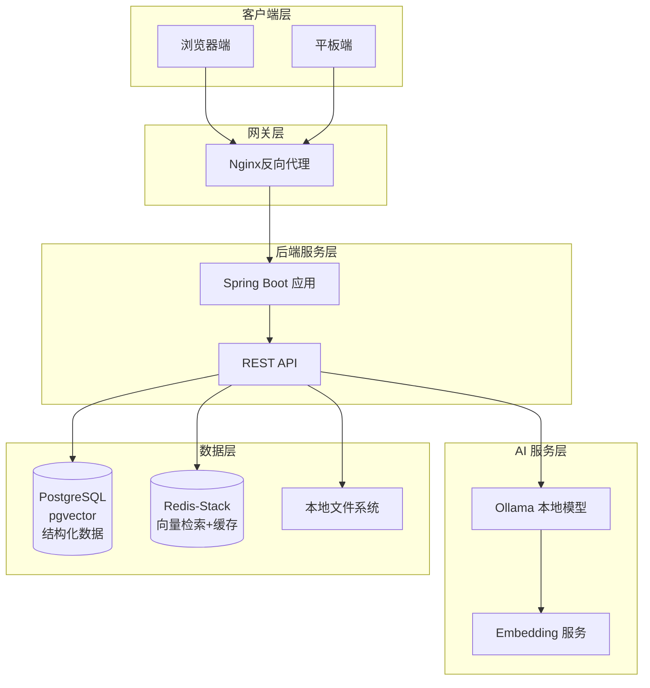
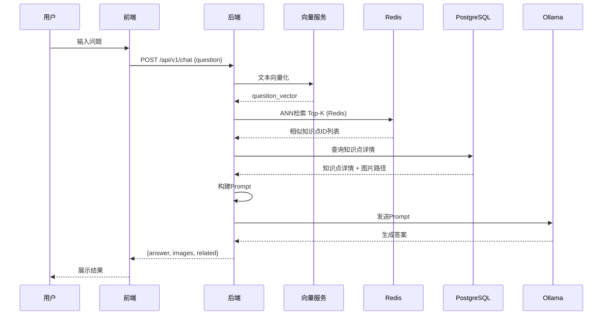
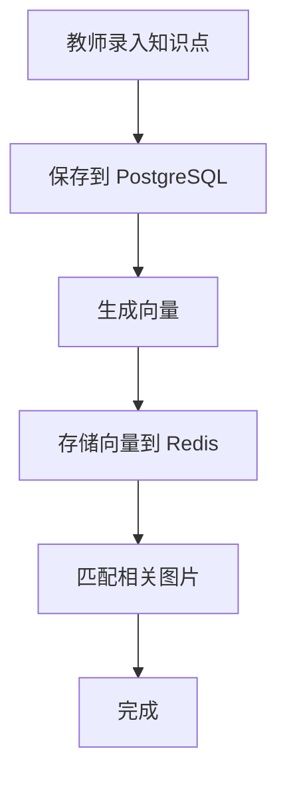
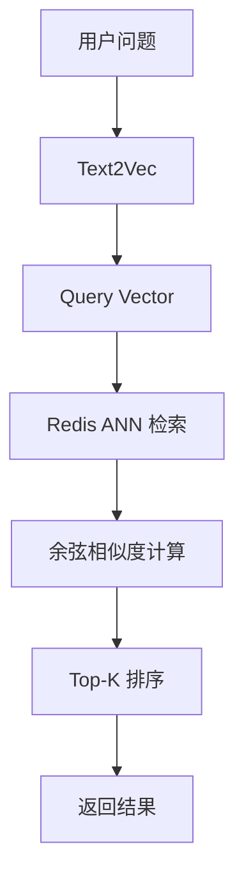

# GeoEdu 技术架构设计

> 本文档详细描述 GeoEdu 地理智能问答系统的技术架构，包括系统架构图、技术选型对比、模块划分与部署方案。

## 1. 系统架构概述

### 1.1 整体架构图



### 1.2 架构特点

| 特点 | 说明 |
|------|------|
| 前后端分离 | 前端独立部署，通过 REST API 通信 |
| 本地化 AI | 使用 Ollama 部署 Qwen2.5-7B，无需外网 |
| 双数据库架构 | PostgreSQL 存结构化数据，Redis-Stack 处理向量检索与缓存 |
| 离线运行 | 全部组件可内网部署 |

---

## 2. 技术选型详解

### 2.1 技术栈总览

| 层级 | 技术选型 | 版本 | 说明 |
|------|---------|------|------|
| 后端框架 | Spring Boot | 3.x | 企业级应用框架 |
| AI 对接 | Spring AI | 1.x | 统一 AI 抽象层 |
| 本地模型 | Ollama | 0.1+ | LLM 推理引擎 |
| 关系数据库 | PostgreSQL | 15+ | 结构化数据存储 |
| 向量数据库 | Redis-Stack | 7.x | 向量检索 + 缓存 |
| 前端框架 | Vue 3 / React | 18.x | 待定 |
| 构建工具 | Maven | 3.9+ | Java 项目构建 |

### 2.2 技术选型对比

#### 2.2.1 后端框架对比

| 框架 | 优点 | 缺点 | 选择原因 |
|------|------|------|---------|
| Spring Boot |生态完善、易集成AI、社区活跃 | 略显笨重 | 与 Spring AI 深度集成，适合 AI 应用 |
| FastAPI | 轻量异步、Python原生 | Java 集成复杂 | - |
| NestJS | TypeScript 支持好 | 生态较小 | - |

#### 2.2.2 AI 方案对比

| 方案 | 优点 | 缺点 | 选择原因 |
|------|------|------|---------|
| Ollama 本地 | 离线运行、无API费用、数据安全 | 硬件要求高 | 符合教育场景离线需求 |
| OpenAI API | 模型能力强 | 需外网、费用高 | - |
| 百度千帆 | 中文支持好 | 需申请、数据出境 | - |

#### 2.2.3 数据库方案对比

| 方案 | 优点 | 缺点 | 选择原因 |
|------|------|------|----------|
| PostgreSQL + Redis-Stack | 性能最优、职责分离、Redis可扩展缓存 | 组件较多 | **推荐：向量检索性能最佳** |
| 单一 PostgreSQL | 架构简单、运维成本低 | 极端高并发时弱于Redis | 千万级向量时考虑 |
| MySQL + Redis-Stack | MySQL 团队熟悉 | 无原生向量支持 | 需要 MySQL 经验时 |

---

## 3. 模块划分

### 3.1 后端模块结构

```
com.geoedu
├── controller          # 控制层
│   ├── ChatController      # 问答接口
│   ├── KnowledgeController  # 知识库接口
│   └── AdminController      # 管理接口
├── service            # 业务层
│   ├── ChatService         # 问答业务
│   ├── KnowledgeService    # 知识库业务
│   ├── VectorService       # 向量服务
│   └── ImageService        # 图片服务
├── repository         # 数据访问层
│   ├── KnowledgeRepository
│   └── QuestionRepository
├── model              # 数据模型
│   ├── entity             # 实体类
│   ├── dto               # 数据传输对象
│   └── embedding         # 向量模型
├── config            # 配置类
│   ├── OllamaConfig
│   ├── PostgresConfig
│   └── SecurityConfig
└── util              # 工具类
```

### 3.2 模块职责说明

| 模块 | 职责 | 关键类 |
|------|------|--------|
| ChatController/Service | 处理问答请求，协调检索与生成 | ChatController, ChatService |
| KnowledgeController/Service | 知识点 CRUD，向量构建 | KnowledgeController, KnowledgeService |
| VectorService | 文本向量化，向量存储与检索（Redis） | VectorService |
| AuthService | 登录注册、Token 管理（Redis 缓存） | AuthService |
| ImageService | 图片上传、压缩、存储 | ImageService |

### 3.3 前端模块结构（待定）

```
src/
├── views/            # 页面
│   ├── ChatView         # 问答页面
│   ├── KnowledgeView   # 知识管理页面
│   └── HistoryView     # 历史记录页面
├── components/       # 组件
│   ├── ChatInput         # 输入框组件
│   ├── AnswerDisplay     # 答案展示组件
│   └── ImageCarousel     # 图片轮播组件
├── stores/           # 状态管理
│   └── chatStore        # 问答状态
└── api/              # API 调用
    └── index.ts         # 接口封装
```

---

## 4. 部署架构

### 4.1 部署架构图

```mermaid
flowchart LR
    subgraph Client["客户端"]
        User1[学生端]
        User2[教师端]
        User3[管理端]
    end

    subgraph Server["部署服务器"]
        Frontend[Nginx<br/>前端静态文件]
        SpringBoot[JAR<br/>Spring Boot]
        Ollama[Ollama<br/>模型推理]
        PostgreSQL[(PostgreSQL)]
        Redis[(Redis-Stack)]
        Images[/images<br/>图片存储]
    end

    User1 --> Frontend
    User2 --> Frontend
    User3 --> Frontend
    Frontend --> SpringBoot
    SpringBoot --> Ollama
    SpringBoot --> PostgreSQL
    SpringBoot --> Redis
    SpringBoot --> Images
```

### 4.2 环境要求

| 组件 | 最低配置 | 推荐配置 |
|------|---------|---------|
| CPU | 8核 | 16核+ |
| 内存 | 16GB | 32GB+ |
| 硬盘 | 100GB SSD | 500GB SSD |
| GPU | - | NVIDIA 8GB+ 显存 |

### 4.3 Docker Compose 部署

```yaml
version: '3.8'
services:
  postgres:
    image: postgres:16
    environment:
      POSTGRES_DB: geoedu
      POSTGRES_USER: geoedu
      POSTGRES_PASSWORD: ${DB_PASSWORD}
    volumes:
      - postgres_data:/var/lib/postgresql/data
    ports:
      - "5432:5432"

  redis:
    image: redis/redis-stack:7.2
    volumes:
      - redis_data:/data
    ports:
      - "6379:6379"
      - "8001:8001"  # RedisInsight 管理界面

  app:
    build: .
    depends_on:
      - postgres
      - redis
    environment:
      SPRING_DATASOURCE_URL: jdbc:postgresql://postgres:5432/geoedu
      SPRING_REDIS_URL: redis://redis:6379
      OLLAMA_BASE_URL: http://host.docker.internal:11434
    ports:
      - "8080:8080"

  ollama:
    image: ollama/ollama
    volumes:
      - ollama_data:/root/.ollama
    ports:
      - "11434:11434"
    deploy:
      resources:
        reservations:
          devices:
            - driver: nvidia
              count: all
              capabilities: [gpu]

volumes:
  postgres_data
  redis_data
  ollama_data
```

---

## 5. 数据流设计

### 5.1 问答数据流



### 5.2 数据写入流



---

## 6. 核心算法设计

### 6.1 向量检索算法

**流程**：



**相似度公式**：

$$
similarity(A, B) = \frac{A \cdot B}{\|A\| \times \|B\|} = \frac{\sum_{i=1}^{n} A_i B_i}{\sqrt{\sum_{i=1}^{n} A_i^2} \times \sqrt{\sum_{i=1}^{n} B_i^2}}
$$

**Redis 向量检索命令示例**：

```bash
# 存储向量
HSET knowledge:vector:G1-1-01 vector "[0.123, -0.456, ...]"

# ANN 检索（使用 Redis Search 模块）
FT.SEARCH idx:knowledge "(@grade:{G1}) => [KNN 3 @vector $vec]" PARAMS 3 vec "[0.1, -0.2, ...]"
```

### 6.2 Prompt 构建模板

```markdown
## 角色设定
你是一位专业的中学地理教师，负责解答学生提出的地理问题。

## 知识参考
以下是相关的知识点供参考：
{retrieved_knowledge}

## 回答要求
1. 回答控制在150字以内
2. 使用清晰的分点说明
3. 适当使用地理专业术语
4. 如有配图需求，在回答末尾注明

## 学生问题
{user_question}

## 回答
```

---

## 7. 安全设计

### 7.1 安全措施

| 措施 | 说明 |
|------|------|
| 输入验证 | 参数类型、长度、白名单校验 |
| SQL 防护 | 参数化查询，避免注入 |
| 文件上传 | 类型白名单、大小限制、文件名脱敏 |
| 日志脱敏 | 禁止记录敏感信息 |
| 离线部署 | 无外网依赖，数据不出网 |

### 7.2 权限控制

| 角色 | 权限范围 |
|------|---------|
| 学生 | 提问、查看历史 |
| 教师 | + 知识库录入、图片上传 |
| 管理员 | + 系统配置、日志查看 |

---

## 8. 配置管理

### 8.1 环境变量

| 变量 | 说明 | 默认值 |
|------|------|--------|
| SPRING_DATASOURCE_URL | PostgreSQL 连接地址 | jdbc:postgresql://localhost:5432/geoedu |
| SPRING_DATASOURCE_USERNAME | 数据库用户名 | geoedu |
| SPRING_DATASOURCE_PASSWORD | 数据库密码 | - |
| OLLAMA_BASE_URL | Ollama 服务地址 | http://localhost:11434 |
| OLLAMA_MODEL | 使用的模型名称 | qwen2.5:7b |

### 8.2 配置文件结构

```yaml
# application.yml
spring:
  datasource:
    url: ${SPRING_DATASOURCE_URL}
    username: ${SPRING_DATASOURCE_USERNAME}
    password: ${SPRING_DATASOURCE_PASSWORD}
    driver-class-name: org.postgresql.Driver

ollama:
  base-url: ${OLLAMA_BASE_URL}
  model: ${OLLAMA_MODEL}

app:
  vector:
    dimension: 768
    top-k: 3
  upload:
    path: /data/images
    max-size: 10MB
```

---

## 9. 监控与日志

### 9.1 日志规范

```markdown
[时间戳] [级别] [traceId] [模块] 消息 {上下文}

示例：
[2026-03-28 10:15:30] [INFO] [abc123] [ChatService] 用户提问处理完成 {question_id: q001, duration: 2150ms}
```

### 9.2 日志级别使用

| 级别 | 场景 |
|------|------|
| DEBUG | 开发调试信息 |
| INFO | 关键业务节点（启动、关闭、重要操作） |
| WARN | 可恢复异常情况 |
| ERROR | 需要关注的错误 |
| CRITICAL | 系统级故障 |

---

## 10. 术语表

| 术语 | 定义 |
|------|------|
| RAG | Retrieval-Augmented Generation，检索增强生成 |
| Redis-Stack | Redis 企业版，包含向量搜索、缓存、JSON 等模块 |
| ANN | Approximate Nearest Neighbor，近似最近邻检索 |
| FT.SEARCH | Redis Search 模块的向量检索命令 |
| Embedding | 文本向量化的过程或结果 |
| Spring AI | Spring 生态的 AI 集成框架 |

---

## 11. 参考资料

| 文档 | 说明 |
|------|------|
| [[需求规格说明书.md]] | 功能需求定义 |
| [[数据库设计.md]] | 数据层详细设计 |
| [[API接口设计.md]] | 接口协议定义 |
| [[构想.md]] | 项目原始规划 |

---

> 本文档版本：v1.2
> 生成日期：2026-03-28
> 更新说明：架构调整为 PostgreSQL + Redis-Stack 双数据库方案
