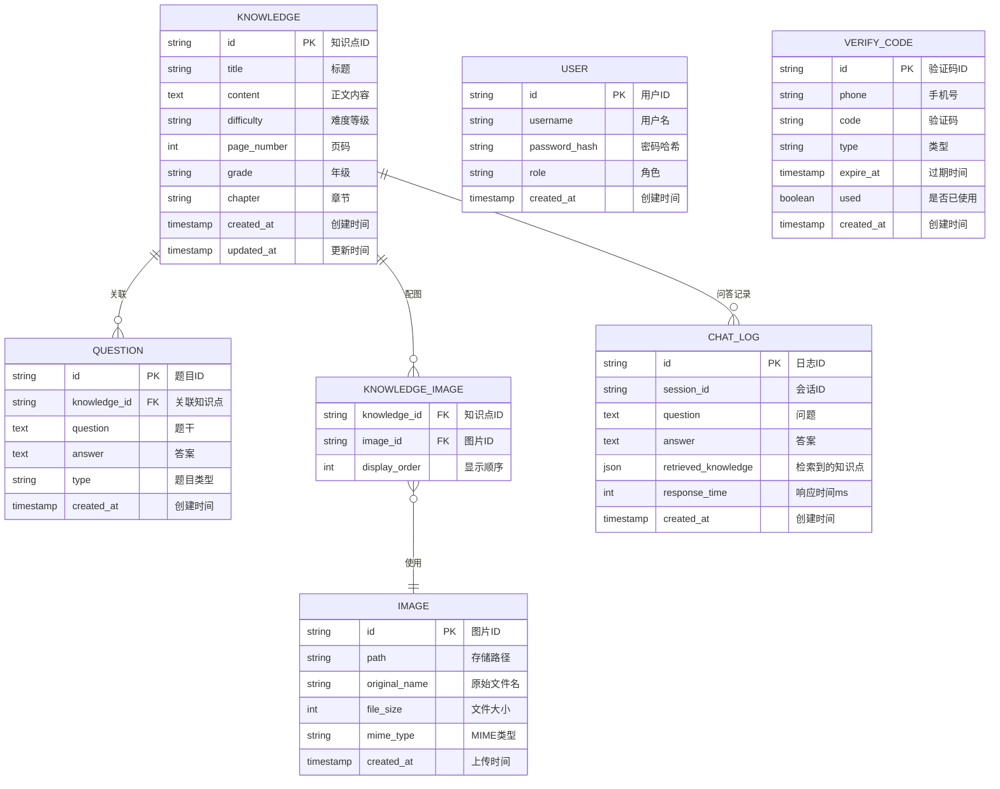

# GeoEdu 数据库设计

> 本文档详细描述 GeoEdu 系统的数据库表结构设计，包括 ER 图、索引策略、数据类型定义。

## 1. 数据库选型

### 1.1 数据库架构

| 数据库 | 用途 | 数据类型 |
|--------|------|---------|
| PostgreSQL | 关系型数据存储 | 知识点、题目、用户、日志 |
| Redis-Stack | 向量存储与检索、缓存 | 文本向量、会话缓存、Token缓存 |

### 1.2 Redis-Stack 核心能力

| 能力 | 说明 |
|------|------|
| Vector Search | 向量相似度检索（ANN），支持余弦相似度 |
| Hash | 结构化向量数据存储 |
| String | Token 缓存、验证码缓存 |
| JSON | 半结构化数据缓存 |

---

## 2. ER 图

### 2.1 实体关系图



---

## 3. 表结构设计

### 3.1 知识点表 (knowledge)

```sql
CREATE TABLE knowledge (
    id VARCHAR(50) PRIMARY KEY,
    title VARCHAR(200) NOT NULL,
    content TEXT NOT NULL,
    difficulty VARCHAR(10) DEFAULT 'medium',
    page_number INTEGER,
    grade VARCHAR(20),
    chapter VARCHAR(50),
    created_at TIMESTAMP DEFAULT CURRENT_TIMESTAMP,
    updated_at TIMESTAMP DEFAULT CURRENT_TIMESTAMP,

    CONSTRAINT chk_difficulty CHECK (difficulty IN ('easy', 'medium', 'hard'))
);

COMMENT ON TABLE knowledge IS '地理知识点表';
COMMENT ON COLUMN knowledge.id IS '知识点ID，格式：G{年级}-{章节}-{序号}';
```

**注意**：向量数据存储在 Redis 中，PostgreSQL 不存储向量字段。

### 3.2 题目表 (question)

```sql
CREATE TABLE question (
    id VARCHAR(50) PRIMARY KEY,
    knowledge_id VARCHAR(50) NOT NULL REFERENCES knowledge(id) ON DELETE CASCADE,
    question TEXT NOT NULL,
    answer TEXT NOT NULL,
    type VARCHAR(20) DEFAULT 'default',
    created_at TIMESTAMP DEFAULT CURRENT_TIMESTAMP
);

CREATE INDEX idx_question_knowledge ON question(knowledge_id);

COMMENT ON TABLE question IS '问答题目表';
COMMENT ON COLUMN question.type IS '题目类型：default/simple/analysis';
```

### 3.3 图片表 (image)

```sql
CREATE TABLE image (
    id VARCHAR(50) PRIMARY KEY,
    path VARCHAR(500) NOT NULL,
    original_name VARCHAR(255),
    file_size BIGINT,
    mime_type VARCHAR(50),
    created_at TIMESTAMP DEFAULT CURRENT_TIMESTAMP
);

COMMENT ON TABLE image IS '图片资源表';
```

### 3.4 知识点-图片关联表 (knowledge_image)

```sql
CREATE TABLE knowledge_image (
    knowledge_id VARCHAR(50) NOT NULL REFERENCES knowledge(id) ON DELETE CASCADE,
    image_id VARCHAR(50) NOT NULL REFERENCES image(id) ON DELETE CASCADE,
    display_order INTEGER DEFAULT 0,
    PRIMARY KEY (knowledge_id, image_id)
);

COMMENT ON TABLE knowledge_image IS '知识点与图片多对多关联表';
```

### 3.5 问答日志表 (chat_log)

```sql
CREATE TABLE chat_log (
    id VARCHAR(50) PRIMARY KEY,
    session_id VARCHAR(50),
    question TEXT NOT NULL,
    answer TEXT,
    retrieved_knowledge JSONB,
    response_time INTEGER,
    user_id VARCHAR(50),
    created_at TIMESTAMP DEFAULT CURRENT_TIMESTAMP
);

CREATE INDEX idx_chat_log_session ON chat_log(session_id);
CREATE INDEX idx_chat_log_created ON chat_log(created_at);

COMMENT ON TABLE chat_log IS '问答交互日志表';
```

### 3.6 用户表 (user)

```sql
CREATE TABLE user (
    id VARCHAR(50) PRIMARY KEY,
    username VARCHAR(50) UNIQUE NOT NULL,
    password_hash VARCHAR(255) NOT NULL,
    role VARCHAR(20) DEFAULT 'student',
    created_at TIMESTAMP DEFAULT CURRENT_TIMESTAMP
);

CREATE INDEX idx_user_username ON user(username);

COMMENT ON TABLE user IS '用户表';
COMMENT ON COLUMN user.role IS '角色：student/teacher/admin';
```

---

## 4. 索引设计

### 4.1 索引策略

| 表名 | 索引类型 | 字段 | 用途 |
|------|---------|------|------|
| knowledge | B-tree | grade, chapter | 按年级章节筛选 |
| knowledge | B-tree | difficulty | 按难度筛选 |
| question | B-tree | knowledge_id | 题目关联查询 |
| chat_log | B-tree | session_id | 历史记录查询 |
| chat_log | B-tree | created_at | 日志时间范围查询 |
| user | B-tree | username | 登录认证 |
| verify_code | B-tree | phone, expire_at | 验证码查询 |

### 4.2 向量索引配置

向量索引在 Redis 中创建和管理：

```sql
-- 创建 Redis 向量索引（通过 redis-cli 或应用代码）
FT.CREATE idx:knowledge SCHEMA
    id TEXT
    title TEXT
    grade TAG
    chapter TAG
    vector VECTOR HNSW 6 DIM 768 TYPE FLOAT32 DISTANCE_METRIC COSINE
```

---

## 5. Redis 数据结构设计

### 5.1 向量存储（核心）

向量数据存储在 Redis Hash 中，配合 Redis Search 模块实现 ANN 检索：

| Key 模式 | 数据结构 | 说明 |
|---------|---------|------|
| `knowledge:vector:{id}` | Hash | 存储单个知识点的向量 |
| `knowledge:meta:{id}` | Hash | 存储知识点元数据 |
| `idx:knowledge` | Index | 向量索引，支持 ANN 检索 |

**向量存储结构**：

```json
// knowledge:vector:G1-1-01
HSET knowledge:vector:G1-1-01 vector "[0.123, -0.456, ...]" dim 768

// knowledge:meta:G1-1-01
HSET knowledge:meta:G1-1-01 title "地球自转的地理意义" grade "G1" chapter "1"
```

**Redis Search 索引配置**：

```bash
FT.CREATE idx:knowledge ON HASH PREFIX 1 knowledge: SCHEMA
    id TEXT
    title TEXT
    grade TAG
    chapter TAG
    vector VECTOR HNSW 6 DIM 768 TYPE FLOAT32 DISTANCE_METRIC COSINE
```

### 5.2 认证与缓存

| Key 模式 | 数据结构 | 说明 | 过期时间 |
|---------|---------|------|---------|
| `token:{token_id}` | String | JWT Token 缓存 | 7天 |
| `user:session:{user_id}` | Hash | 用户会话信息 | 24小时 |
| `verify:code:{phone}` | String | 手机验证码 | 5分钟 |
| `ratelimit:chat:{user_id}` | String | 问答接口限流计数 | 1分钟 |

**Token 缓存示例**：

```json
// SET token:abc123 "{\"user_id\":\"U001\",\"role\":\"student\"}"
// TTL 604800（7天）
```

**验证码缓存示例**：

```json
// SET verify:code:13800138000 "123456" EX 300
```

### 5.3 热点数据缓存

| Key 模式 | 数据结构 | 说明 | 过期时间 |
|---------|---------|------|---------|
| `cache:chat:{session_id}` | Hash | 问答结果缓存 | 1小时 |
| `cache:hot:knowledge` | ZSet | 热门知识点排名 | 24小时 |

### 5.4 Redis 命令示例

```bash
# 存储知识点向量
HSET knowledge:vector:G1-1-01 vector "[0.123, -0.456, ...]"

# 检索最相似的 Top-3 知识点
FT.SEARCH idx:knowledge "*=>[KNN 3 @vector $vec]" PARAMS 2 vec "[0.1, -0.2, ...]"

# 带过滤条件的检索
FT.SEARCH idx:knowledge "@grade:{G1} =>[KNN 3 @vector $vec]" PARAMS 2 vec "[0.1, -0.2, ...]"

# 存储 Token
SET token:abc123 '{"user_id":"U001"}' EX 604800

# 存储验证码
SET verify:code:13800138000 "123456" EX 300
```

---

## 6. 数据类型详解

### 6.1 ID 生成规则

| 实体 | ID 格式 | 示例 |
|------|--------|------|
| 知识点 | G{年级}-{章节}-{序号} | G1-1-01 |
| 题目 | Q{类型}{序号} | Q1, Q2 |
| 图片 | IMG{时间戳}{随机数} | IMG20260328123456a |
| 用户 | U{序号} | U001 |
| 会话 | session_{时间戳} | session_1711545600 |

### 6.2 枚举值定义

| 字段 | 可选值 | 说明 |
|------|-------|------|
| difficulty | easy / medium / hard | 难度等级 |
| role | student / teacher / admin | 用户角色 |
| type (question) | default / simple / analysis | 题目类型 |

---

## 7. 约束与规范

### 7.1 表级约束

```sql
-- 难度等级约束
ALTER TABLE knowledge ADD CONSTRAINT chk_difficulty
    CHECK (difficulty IN ('easy', 'medium', 'hard'));

-- 用户角色约束
ALTER TABLE user ADD CONSTRAINT chk_role
    CHECK (role IN ('student', 'teacher', 'admin'));
```

### 7.2 命名规范

| 类型 | 规范 | 示例 |
|------|------|------|
| 表名 | 小写下划线，复数形式 | knowledge, chat_log |
| 字段名 | 小写下划线 | page_number, created_at |
| 主键 | `{表名}_id` 或业务ID | id, knowledge_id |
| 外键 | `{参照表名}_id` | knowledge_id, image_id |
| 索引名 | `idx_{表名}_{字段}` | idx_knowledge_grade |

---

## 8. 分页与查询

### 8.1 分页查询示例

```sql
-- 按年级章节分页查询知识点
SELECT * FROM knowledge
WHERE grade = 'G1' AND chapter = '1'
ORDER BY id
LIMIT 20 OFFSET 0;

-- 向量相似度检索
SELECT id, title,
       1 - (embedding <=> '[0.1, -0.2, ...]') AS similarity
FROM knowledge
ORDER BY embedding <=> '[0.1, -0.2, ...]'
LIMIT 3;
```

---

## 9. 参考资料

| 文档 | 说明 |
|------|------|
| [[需求规格说明书.md]] | 功能需求定义 |
| [[技术架构设计.md]] | 技术架构 |
| [[关于数据.txt]] | 原始数据结构设计 |

---

> 本文档版本：v1.1
> 生成日期：2026-03-28
> 更新说明：调整为 PostgreSQL + Redis-Stack 双数据库方案，Redis 负责向量检索与缓存
