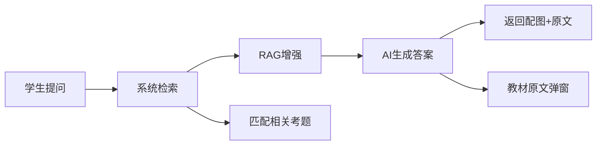
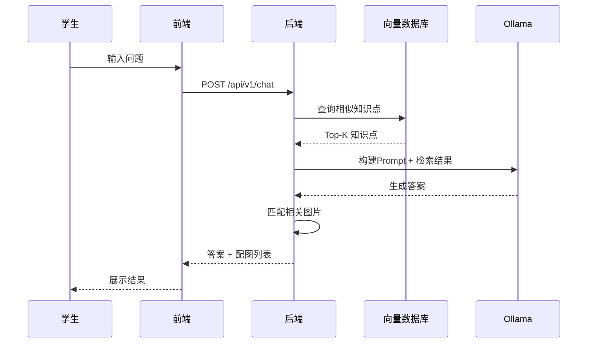
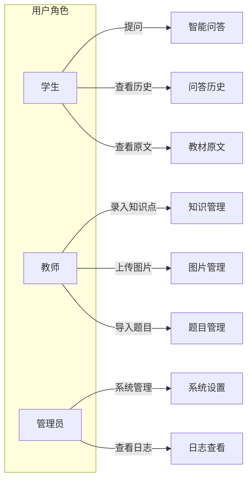

# GeoEdu 需求规格说明书

> 本文档基于项目构想、技术选型及数据设计等原始资料生成，用于明确 GeoEdu 地理智能问答系统的功能需求与非功能需求。

## 1. 项目概述

### 1.1 项目背景

GeoEdu 是一款面向中学地理教育的智能问答系统，旨在通过 RAG（检索增强生成）技术，结合本地化部署的大语言模型，为学生和教师提供精准、权威的地理知识问答服务。

**项目定位**：
- 辅助学生课后复习与自主学习
- 为教师提供教学资源检索工具
- 构建可离线运行的课堂智能助手

### 1.2 项目目标

| 阶段 | 时间 | 目标 |
|------|------|------|
| 试点期 | 2026年4-5月 | 针对人教版必修一或两章内容，完成小规模试点 |
| 扩展期 | 2026年6-9月 | 根据反馈调整，扩大至整个高中地理知识库 |
| 推广期 | 2026年9月起 | 逐步面向初高中全学科扩展 |
| 参赛期 | 2027年 | 完成项目优化与参赛材料准备 |

### 1.3 核心价值



---

## 2. 功能需求

### 2.1 知识库管理

#### 2.1.1 知识点管理

**功能描述**：对地理知识点进行 CRUD 操作，支持批量导入。

**数据模型**：

| 字段 | 类型 | 说明 |
|------|------|------|
| id | String | 知识点唯一标识，格式：G{年级}-{章节}-{序号} |
| title | String | 知识点标题 |
| content | Text | 知识点正文内容 |
| difficulty | Enum | 难度等级：easy / medium / hard |
| page_number | Integer | 教材页码 |
| image_paths | Array[String] | 配图路径列表 |

**接口需求**：

| 接口 | 方法 | 说明 |
|------|------|------|
| /api/v1/knowledge | POST | 创建知识点 |
| /api/v1/knowledge/{id} | GET | 获取知识点详情 |
| /api/v1/knowledge | GET | 列表查询（分页+筛选） |
| /api/v1/knowledge/{id} | PUT | 更新知识点 |
| /api/v1/knowledge/{id} | DELETE | 删除知识点 |
| /api/v1/knowledge/batch | POST | 批量导入知识点 |

#### 2.1.2 题目管理

**功能描述**：管理与知识点关联的问答题目。

**数据模型**：

| 字段 | 类型 | 说明 |
|------|------|------|
| id | String | 题目唯一标识 |
| knowledge_id | String | 关联知识点ID |
| question | Text | 题干 |
| answer | Text | 答案 |

**接口需求**：

| 接口 | 方法 | 说明 |
|------|------|------|
| /api/v1/question | POST | 创建题目 |
| /api/v1/question/batch | POST | 批量导入题目 |

#### 2.1.3 图片管理

**功能描述**：处理知识点的配图上传与存储。

**功能要求**：
- 支持 JPEG/PNG 格式上传
- 自动压缩优化（最大边1920px，质量85%）
- 图片命名规范：`{知识点ID}_{序号}.jpg`
- 存储至本地文件系统或对象存储

### 2.2 智能问答

#### 2.2.1 问答接口

**功能描述**：接收学生问题，返回 AI 生成答案及相关配图。

**交互流程**：



**请求参数**：

| 参数 | 类型 | 必填 | 说明 |
|------|------|------|------|
| question | String | 是 | 学生提问 |
| top_k | Integer | 否 | 检索结果数量，默认3 |

**响应结构**：

```json
{
  "code": 0,
  "message": "success",
  "data": {
    "answer": "地转偏向力是...",
    "images": [
      {
        "path": "/images/G1-1-01_1.jpg",
        "caption": "地转偏向力示意图"
      }
    ],
    "related_knowledge": [
      {
        "id": "G1-1-01",
        "title": "地球自转的地理意义"
      }
    ]
  },
  "timestamp": 1711545600
}
```

#### 2.2.2 辅助功能

| 功能 | 说明 |
|------|------|
| 教材原文弹窗 | 点击按钮显示知识点的完整原文 |
| 相关考题折叠 | 展示与当前问题相关的1-3道练习题 |
| 问答历史 | 记录用户的问答记录，支持回看 |

### 2.3 知识库录入工具

**目标用户**：地理学科教师或助理

**功能要求**：
- 简易后台管理界面
- 知识点增删改查
- Excel/JSON 批量导入
- 图片上传与编辑

---

## 3. 非功能需求

### 3.1 性能需求

| 指标 | 要求 | 说明 |
|------|------|------|
| 问答响应时间 | ≤ 3秒 | 从提问到返回答案的端到端时间 |
| 向量检索时间 | ≤ 500ms | 相似度计算时间 |
| 支持并发数 | ≥ 50 | 允许同时在线用户数 |
| 知识点数量 | 支持万级 | 初期覆盖高中地理约5000知识点 |

### 3.2 安全性需求

| 需求 | 说明 |
|------|------|
| 离线运行 | 支持完全内网部署，不依赖外网 |
| 数据隔离 | 用户数据相互隔离 |
| 输入过滤 | 对用户输入进行安全过滤 |
| 敏感信息 | 不记录用户敏感信息 |

### 3.3 兼容性需求

| 类型 | 要求 |
|------|------|
| 浏览器 | Chrome / Edge / Firefox / Safari 最新两个版本 |
| 屏幕适配 | 桌面端（1920×1080）与平板端（1024×768） |
| 操作系统 | Windows 10+ / macOS 10.14+ |
| 后端环境 | JDK 17+ / Spring Boot 3.x |

### 3.4 可靠性需求

| 指标 | 要求 |
|------|------|
| 系统可用性 | ≥ 99% |
| 数据持久化 | 定期自动备份 |
| 错误恢复 | 异常状态友好提示，自动恢复 |

---

## 4. 系统用例

### 4.1 用例图



### 4.2 核心用例说明

#### UC-01：学生提问

| 项目 | 内容 |
|------|------|
| 用例ID | UC-01 |
| 用例名称 | 学生提问 |
| 参与者 | 学生 |
| 前置条件 | 用户已登录或无需登录 |
| 基本流程 | 1. 输入问题 → 2. 提交 → 3. 获取答案与配图 |
| 异常处理 | 问题无法理解时，返回"请重新描述您的问题" |
| 后置条件 | 问题与答案存入问答历史 |

#### UC-02：知识库录入

| 项目 | 内容 |
|------|------|
| 用例ID | UC-02 |
| 用例名称 | 知识库录入 |
| 参与者 | 教师/管理员 |
| 前置条件 | 登录后台管理系统 |
| 基本流程 | 1. 选择录入方式（单条/批量） → 2. 填写/上传数据 → 3. 确认提交 → 4. 系统验证 → 5. 返回结果 |
| 异常处理 | 数据格式错误时，显示具体错误行与原因 |
| 后置条件 | 知识点数据入库，触发向量更新 |

#### UC-03：批量数据导入

| 项目 | 内容 |
|------|------|
| 用例ID | UC-03 |
| 用例名称 | 批量数据导入 |
| 参与者 | 教师/管理员 |
| 输入 | Excel 或 JSON 文件 |
| 基本流程 | 1. 选择文件 → 2. 系统解析 → 3. 数据预览 → 4. 确认导入 → 5. 批量写入 → 6. 返回导入报告 |
| 验证规则 | 文件大小≤10MB，单次导入≤1000条 |

---

## 5. 用户故事地图

### 5.1 学生用户故事

| ID | 用户故事 | 验收标准 |
|----|---------|---------|
| US-01 | 作为学生，我希望提问后快速获得答案 | 3秒内返回结果 |
| US-02 | 作为学生，我希望看到配套的图片帮助理解 | 图片清晰且与内容相关 |
| US-03 | 作为学生，我希望查看教材原文 | 点击可弹出原文窗口 |
| US-04 | 作为学生，我希望查看问答历史 | 可回看最近20条记录 |
| US-05 | 作为学生，我希望看到相关练习题 | 显示1-3道关联题目 |

### 5.2 教师用户故事

| ID | 用户故事 | 验收标准 |
|----|---------|---------|
| US-10 | 作为教师，我希望批量导入知识点 | 支持Excel格式，1000条/批 |
| US-11 | 作为教师，我希望上传配图 | 支持拖拽上传，自动压缩 |
| US-12 | 作为教师，我希望编辑已有知识点 | 可修改任意字段 |
| US-13 | 作为教师，我希望查看使用数据 | 了解热点问题与使用频率 |

### 5.3 管理员用户故事

| ID | 用户故事 | 验收标准 |
|----|---------|---------|
| US-20 | 作为管理员，我希望系统可离线部署 | 无外网依赖 |
| US-21 | 作为管理员，我希望定期备份数据 | 支持手动/自动备份 |
| US-22 | 作为管理员，我希望查看运行日志 | 日志可搜索、可导出 |

---

## 6. 验收标准

### 6.1 功能验收

| 功能模块 | 验收条件 |
|---------|---------|
| 知识库管理 | CRUD操作正常，批量导入成功率100% |
| 智能问答 | 答案准确率≥80%（试点期），响应时间≤3秒 |
| 配图展示 | 图片加载成功率≥99% |
| 历史记录 | 记录完整，支持分页查询 |

### 6.2 性能验收

| 指标 | 达标条件 |
|------|---------|
| 响应时间 | P95 ≤ 3秒 |
| 并发能力 | 50用户同时在线无报错 |
| 启动时间 | 冷启动 ≤ 30秒 |

---

## 7. 术语表

| 术语 | 定义 |
|------|------|
| RAG | Retrieval-Augmented Generation，检索增强生成 |
| 向量检索 | 将文本转为向量，通过余弦相似度进行语义匹配 |
| Top-K | 返回最相似的K个结果 |
| 知识点 | 地理教材中的最小教学单元 |

---

## 8. 参考资料

| 文档 | 说明 |
|------|------|
| [[构想.md]] | 项目整体规划与分工 |
| [[技术选型.txt]] | 技术栈选择 |
| [[关于数据.txt]] | 数据结构设计 |
| [[技术架构设计.md]] | 系统技术架构 |
| [[数据库设计.md]] | 数据库表结构设计 |
| [[API接口设计.md]] | 接口协议定义 |

---

> 本文档版本：v1.0
> 生成日期：2026-03-28
> 状态：待补充
